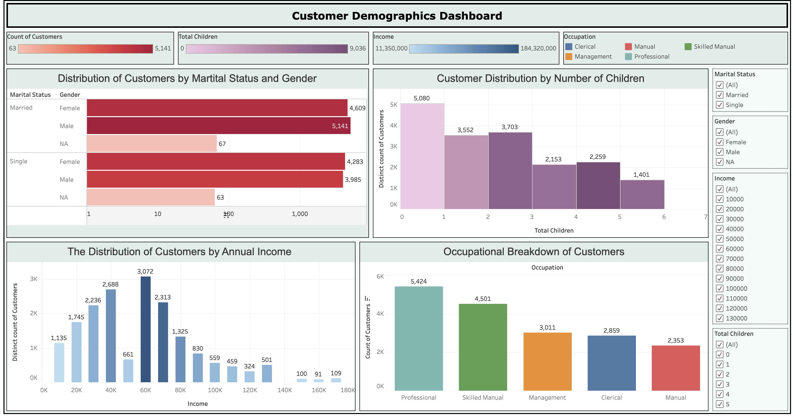
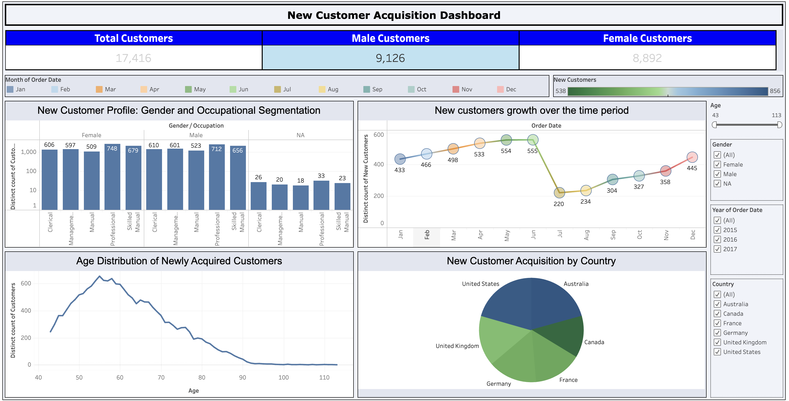
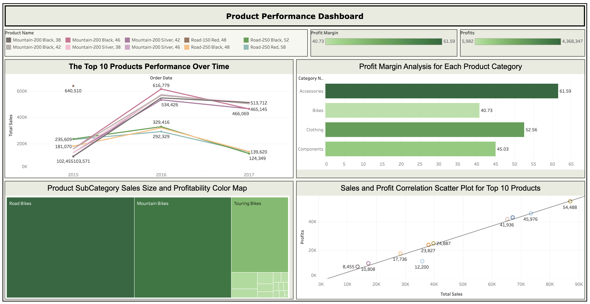
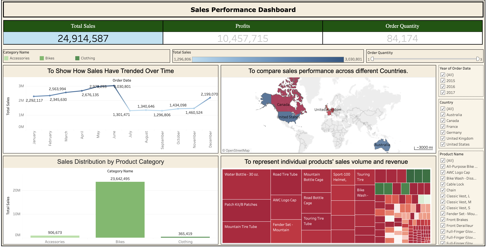

# Business Analytics Visualization:  Customer and Sales Trends

## Project Overview
This repository showcases a set of interactive Tableau dashboards developed using the AdventureWorks sample dataset. These dashboards provide insights into customer demographics, sales performance, product analysis, and new customer acquisition.

## Dashboards

### Customer Demographics Dashboard

- **Marital Status and Gender Distribution**: Displays the count of customers by marital status (Married, Single) and gender.
- **Customer Distribution by Number of Children**: Shows how the customer base is segmented by the number of children.
- **Annual Income Breakdown**: Visualizes the distribution of customers by income brackets.
- **Occupational Breakdown**: Categorizes the customers by their occupation into Professional, Skilled Manual, Clerical, Management, and Manual.

### New Customer Acquisition Dashboard

- **Gender and Occupational Segmentation**: Highlights the distribution of newly acquired customers by gender and occupation.
- **New Customer Growth Over Time**: A line graph depicting the month-over-month growth in new customer acquisition.
- **Age Distribution**: Shows the age distribution of newly acquired customers.
- **Country-wise Acquisition**: A pie chart displaying the percentage of new customers from different countries.

### Product Performance Dashboard
 
- **Top 10 Products Performance Over Time**: A multi-line chart tracking sales over time for the top 10 products.
- **Profit Margin Analysis**: Bar charts comparing the profit margin across product categories.
- **Product SubCategory Sales and Profitability**: A color-coded matrix comparing the sales size and profitability for different product subcategories.
- **Sales and Profit Correlation**: A scatter plot demonstrating the correlation between sales and profits for top products.

### Sales Performance Dashboard

- **Total Sales and Profits**: Provides a snapshot of total sales and profits.
- **Sales Trend Over Time**: A line graph illustrating sales trends across different months.
- **Country-wise Sales Performance**: A map visualization representing sales performance in different countries.
- **Sales Distribution by Product Category**: A bar chart breaking down total sales by product category.
- **Individual Product's Sales Volume and Revenue**: A treemap highlighting the sales volume and revenue of individual products.

## Tools Used
- Tableau
- Excel

## How to Use
1. Clone or download the repository including the `.twbx` Tableau workbook files and the datasets from the dataset folder.
2. Open the workbook files using Tableau Desktop.
3. Navigate through the dashboards using the interactive elements to analyze the data.

## Dataset
The AdventureWorks dataset is included in this repository and is used as the basis for all the Tableau visualizations.

